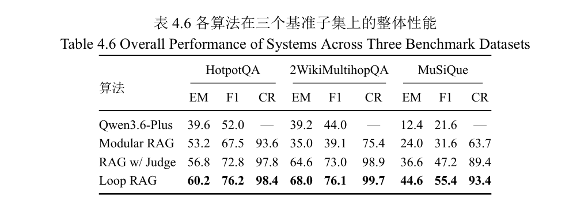
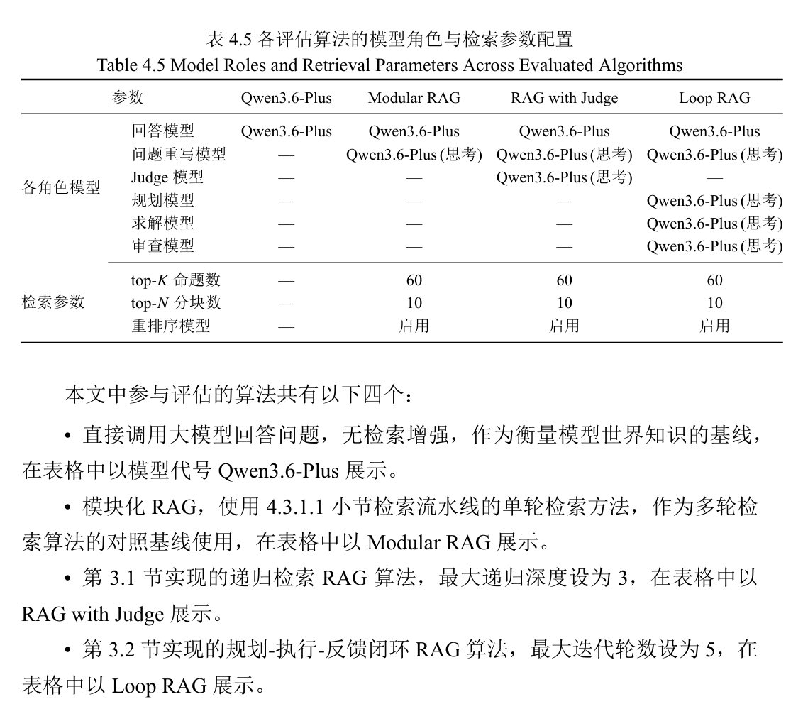
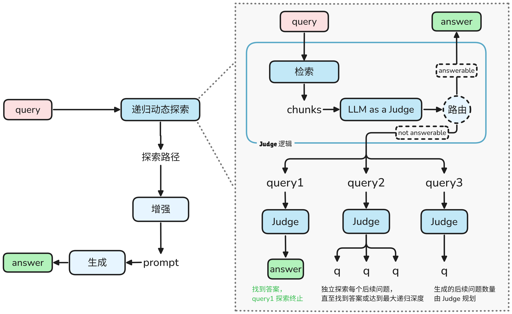
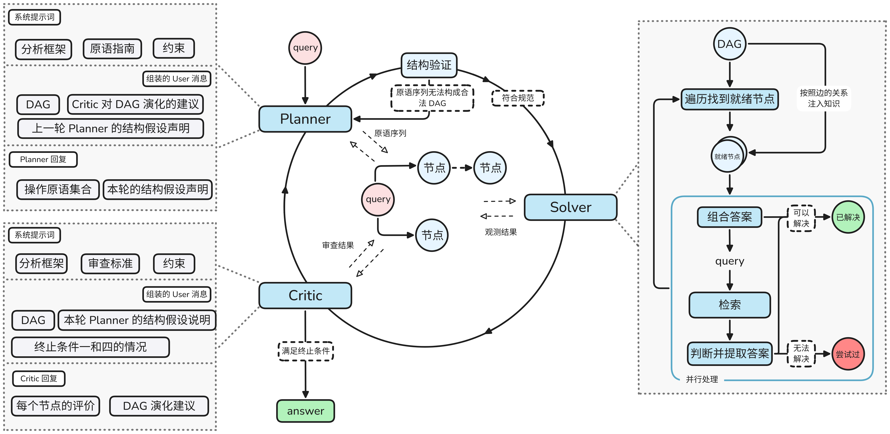

针对使用 RAG 算法求解「多跳问答」，这个项目仓库中包含两种可解释的多轮自适应探索 RAG 算法，分别是「[递归检索 RAG 算法（RAG with Judge）](# 递归检索 RAG 算法)」和「[规划-执行-反馈闭环 RAG 算法（Loop RAG）](# 规划-执行-反馈闭环 RAG 算法)」。这个两个算法在 HotpotQA、2WikiMultihopQA 和 MuSiQue 三个主流多跳问答数据集上的表现如下（其中 CR 指标是「累积召回率（CumulativeRecall）」，表示算法在所有探索轮次中召回的所有文档占支撑段落的比例）：

该结果的实验设置如下：

## 实验结果可视化

### 通用多跳问答数据集

运行命令 `uv run streamlit run frontend/app.py` 后，可以在「🔎实验结果」侧边栏查看所有算法在三个通用多跳问答数据集上的表现

### 标准问答

要进行标准问答，需要：

1. 切换至「💬 在线问答」侧边栏
2. 在页面中填入「API Key」和「Base URL」，完成「API 配置」（当前仅支持阿里百炼的模型）
3. 选择对应的算法与搜索源
4. 配置算法在运行时的一些参数，包括：
   - 搜索返回的最大 Chunk 数
   - 多轮自适应探索 RAG 算法的探索轮次
   - 各角色的 prompt 模板
   - 各角色模型的思考预算

构造的 25 到标准问答数据集在[这里](Data/benchmark/gb_standards_multihop_25.json)。由于网络搜索返回了一些不良信息，算法在标准问答题目上的探索过程并未更新到仓库中，论文中提到的两个例子的可视化结果在[这里](standard_question_result/)。

第一个例子是：Q235C钢的冲击试验应在什么温度下进行？该试验温度的实际允许偏差范围是多少？试样在冷却介质中至少需要保温多长时间？

第二个例子是：Q235B 钢的碳含量（熔炼分析）上限为 0.20%。现有一批 Q235B 钢板，成品分析显示碳含量为 0.22%。请问：根据相关国家标准，这批钢板的碳含量是否合格？为什么？

## 递归检索 RAG 算法

对于多跳问题，一次检索通常无法召回全部所需知识（在采用分块嵌入的索引思路时会面临这样的困境，但如果针对具体任务设计适合的索引过程并辅以对应的搜索算法，一次检索也有可能完成任务）。在 [Iter-RetGen](https://arxiv.org/abs/2305.15294)、[CRAG](https://arxiv.org/abs/2305.15294)、[LLM as a Judge](https://arxiv.org/abs/2411.16594) 等工作的启发下，我设计了[递归检索 RAG 算法](rag_with_judge/)，在模块化 RAG 的基础上引入了 LLM as a Judge 模块，引入的 Judge 模块将根据召回的知识动态生成原子化子问题以递归探索搜索空间。这种递归调用过程将动态生成一颗搜索树，使得算法在回答问题时的推理过程具有可解释性。

## 规划-执行-反馈闭环 RAG 算法

在实现和测试递归 RAG 算法的过程中，我发现其存在：

1. 子树间的知识无法共享，这使得一些问题会被重复探索
2. 生成的树结构无法被回溯更改，这使得探索获得的新知识只能被作为「一次探索记录」被记录到节点中，回答模型需要从探索记录中自己分析、汇总以得到回答问题的信息

归根到底，搜索树承载的是算法在多轮探索过程中自然形成的探索过程，通过节点是否可被直接回答来隐式地表明算法对当前多跳问题的理解。

因此，我设计了[规划-执行-反馈闭环 RAG 算法](rag_loop/)，该算法：

1. 将多跳问题建模为一个有向无环图（DAG），节点表示一个问题，边表示问题间的关系（包括分解边和依赖边）

   算法的任务是：根据搜索到的知识维护一个 [DAG](rag_loop/models.py)，这个 DAG 是对问题真实 DAG 结构的预测

   算法通过规划、求解、审查三个角色智能体的[闭环协同](rag_loop/pipeline.py)来推动 DAG 的迭代演化来实现这个任务

2. [规划智能体](rag_loop/planner.py)通过「[操作原语](rag_loop/operations.py)」来精确表达算法对 DAG 演化的意图

3. [求解智能体](rag_loop/solver.py)诚实地在规划智能体规划的 DAG 上对所有「就绪」节点进行搜索求解（一个非根节点是「就绪」的，当且仅当其所有依赖源节点（即所有通过依赖边指向该节点的节点）均处于已求解状态且答案非空）

   当 DAG 结构偏离真实结构时，求解智能体在给定探测方向上自然检索不到有用信息，这一负面观测为后续审查智能体提供了结构偏差的原始信号。

4. 由于算法在运行过程中无法看到问题对应的真实 DAG 结构，只能通过一些「内部信号（不同节点答案之间的一致性、不同来源之间的独立性、求 解结果与规划意图之间的匹配程度）」来推断当前 DAG 结构是否足够逼近真实 DAG

   [审查智能体](rag_loop/critic.py)通过对求解智能体求解过后的 DAG 进行「逐节点」和「DAG 整体结构」两个维度的审查将内部信号转化为下轮 DAG 演化的建议

5. 规划智能体根据之前求解智能体在 DAG 上的求解情况并参考审查智能体给出的演化建议，使用操作原语精确地表达出新的 DAG 的结构（此时完成了一轮 DAG 的演化）

6. 之后继续求解智能体、审查智能体的循环讨论，直到探索轮次耗尽或预测的 DAG 结构趋于稳定

## 嵌入向量文件说明

三个数据集的命题嵌入文件可以在[这里](https://drive.google.com/drive/folders/1GQHfmq126jBZU3UO6uXJe_4U2py1H5x0?usp=sharing)获取，将下载的包含嵌入向量的文件放在「[Data/benchmark 文件夹](Data/benchmark/)」下后使用命令 `uv run python Index/milvus_cli.py recover` 即可流式地将所有数据集的命题与其嵌入向量插入 Milvus 供之后检索使用

你也可以选择将某一个数据集的命题与其嵌入插入到 Milvus 中，命令为 `uv run python Index/milvus_cli.py recover --dataset hotpotqa/2wikimultihopqa/musique`

## 开源协议

MIT License